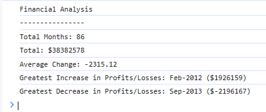

# Console Finances

## Table of Contents
* [Screenshot of page](#screenshot)
* [Information](#information)
* [Installation](#installation)
* [Credits](#credits)
* [License](#license)
* [Tests](#tests)

## Screenshot


## Information
This page was given to me by the edX bootcamp: Skills Boot Camp in Front-End Web Development
My task was to create a webpage which had a console that looked like this:
```text
Financial Analysis 
----------------
Total Months: 86
Total: $38382578
Average Change: -2315.12
Greatest Increase in Profits/Losses: Feb-2012 ($1926159)
Greatest Decrease in Profits/Losses: Sep-2013 ($-2196167)
```

## Installation
Click on this link: https://programmer90000.github.io/portfolio-website/

## Credits
The original page which I copied was from the edX bootcamp: Skills Boot Camp in Front-End Web Development

## License
GNU GENERAL PUBLIC LICENSE (GPL) version 3.0

## Tests
Ensure that the output in the console is the same as the output I was told to re-create